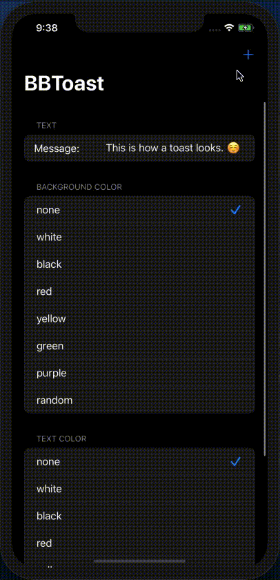
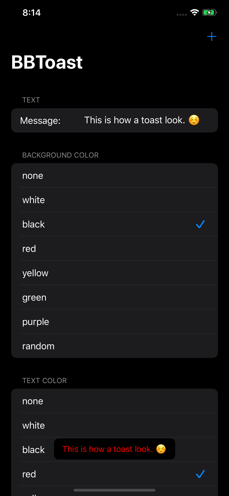
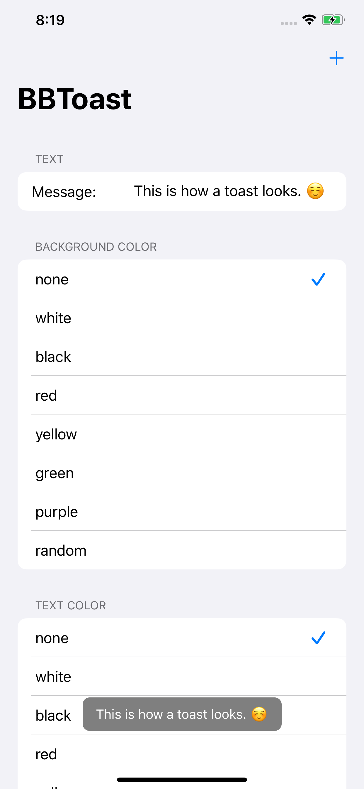

# BBToast

Simple toast with text using BBToast. BBToast is a light-weight minimal looking toast build on top of UIKit for iOS and tvOS. This doesn't obsruct user interaction like while showing a UIAlertController. Package is compiled using Xcode 11.0 on MacOS 10.15 using Swift 5.1

---

## Support

[](https://www.apple.com/in/macos/catalina/)
[](https://developer.apple.com/xcode/)
[](https://developer.apple.com/swift/)

---
## Code

```swift
import UIKit
import BBToast

class ViewController: UIViewController {

    override func viewDidLoad() {
        super.viewDidLoad()

        showBBToast("This is a toast message.", duration: 2) { toast in
            toast.backgroundColor = Color.allCases[self.selectedBackgroundColorIndex].color
            toast.textColor       = Color.allCases[self.selectedTextColorIndex].color
        }
    }
}
```
---
## Working Example

<table>
  <tr>
    <td>Animation</td>
     <td>Dark Mode</td>
     <td>Light Mode</td>
  </tr>
  <tr>
    <td></td>
    <td></td>
    <td></td>
  </tr>
 </table>

 ---
 ## Installation

 ### Swift Package Manager

The [Swift Package Manager](https://swift.org/package-manager/) is a tool for automating the distribution of Swift code and is integrated into the `swift` compiler. It is in early development, but Alamofire does support its use on supported platforms.

Once you have your Swift package set up, adding Alamofire as a dependency is as easy as adding it to the `dependencies` value of your `Package.swift`.

```swift
dependencies: [
    .package(url: "https://github.com/bibinjacobpulickal/BBToast.git", .upToNextMajor(from: "1.0.0"))
]
```

---
## License

BBToast is released under the MIT license. [See LICENSE](https://github.com/bibinjacobpulickal/BBLoader/blob/master/LICENSE) for details.
